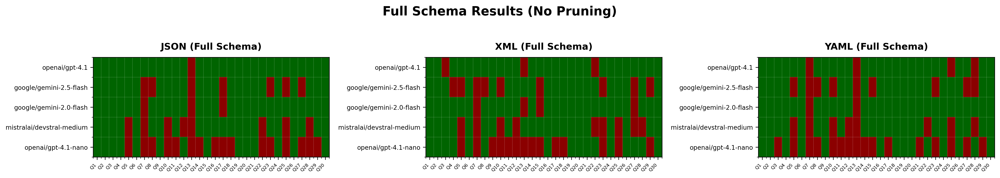
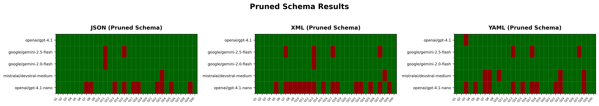

# Text2Cypher: Benchmarking and Improving Results for Graph RAG

This repo contains example code for testing and benchmarking the performance of different models
and prompts when doing `Text2Cypher` for Graph RAG in Kuzu. The prompts are managed in BAML.

The aim of the test suites shown is to understand the impact of schema formatting and pruning on
the overall quality of the generated Cypher queries, which influence the effectiveness of the Graph RAG
pipeline for agentic workflows downstream.

## Setup

Use `uv` to install the dependencies:

```bash
uv sync
```

## Dataset

We use the [LDBC social network benchmark](https://ldbcouncil.org/benchmarks/snb/) (LDBC-1) dataset,
which can be downloaded and loaded into Kuzu as shown below.

```bash
uv run download_dataset.py
uv run create_graph.py
```

## Sample queries

Run sample queries on the graph using the scripts with the name `query_*.py`.

```bash
# Run the pipeline using JSON, XML or YAML schema with pruning
uv run query_graph.py

# Run the pipeline using DDL schema with pruning
uv run query_graph_ddl_schema.py

# Run the pipeline using schema compression
uv run query_graph_compressed.py
```

## Benchmarks

The benchmarks are presented as pytest test suites in the `tests/` directory.

The test suites are designed to check for the following aspects:
- Is JSON, XML or YAML schema desirable for the given LLM to generate good Cypher?
- Is pruning of the schema desirable for the given LLM to generate good Cypher?

"Pruning" refers to the process of isolating only the relevant nodes, relationships and properties
for the given user question, so that LLM only sees the relevant subset of the schema as context
when generating Cypher.

### 1. JSON-formatted schema (full)

A common practice in several prompting frameworks is to stringify the graph schema as JSON and pass
it directly to the Text2Cypher model prompt. The test suite for this case is run as follows:

```bash
uv run pytest tests/test_text2cypher_json_full.py
```

### 2. JSON-formatted schema with pruning

The same JSON schema from #1 is used, but the schema is pruned using a separate LLM prompt. The pruned
schema is then stringified and passed to the Text2Cypher model prompt. The test suite for this case is run
as shown below:

```bash
uv run pytest tests/test_text2cypher_json.py
```

### 3. XML schema (full)

Some LLMs may do better with XML-formatted schemas. The JSON graph schema from #1 is converted to XML
and passed to the Text2Cypher model prompt. The test suite for this case is run as follows:

```bash
uv run pytest tests/test_text2cypher_xml_full.py
```

### 4. XML schema with pruning

The same XML schema from #3 is used, but the schema is pruned using a separate LLM prompt. The pruned
XML schema is then passed to the Text2Cypher model prompt. The test suite for this case is run
as shown below:

```bash
uv run pytest tests/test_text2cypher_xml.py
```

### 5. YAML schema (full)

YAML is another common format for graph schemas. The same JSON graph schema from #1 is converted to YAML
and passed to the Text2Cypher model prompt. The test suite for this case is run as follows:

```bash
uv run pytest tests/test_text2cypher_yaml_full.py
```

### 6. YAML schema with pruning

The same YAML schema from #5 is used, but the schema is pruned using a separate LLM prompt. The pruned
YAML schema is then passed to the Text2Cypher model prompt. The test suite for this case is run
as shown below:

```bash
uv run pytest tests/test_text2cypher_yaml.py
```

### 7. (Experimental) Schema compression

Schema _compression_ is different from pruning in that it's the process of changing the underlying
representation of the schema via a mapping function. The LLM is then able to look up the original
schema's nodes, relationships and properties via the mapping at query generation time, with the hope
that the total number of tokens in the schema is reduced and there is no need for a two-step
process (pruning + Text2Cypher). In the compression approach, a single prompt is used to look up
the schema values, the user's questions and the system instructions.

```bash
uv run pytest tests/test_text2cypher_json_compressed.py
```

### 8. (Experimental) Kuzu DDL schema

Kuzu's DDL schema also has useful information for the purposes of Text2Cypher -- it contains the
schema's nodes, relationships and properties, as well as the data types of the properties. This
experiment tests whether the DDL commands (`CREATE NODE TABLE...`, `CREATE REL TABLE ...`, etc.)
can be pruned and then used by the Text2Cypher model prompt.

```bash
uv run pytest tests/test_text2cypher_ddl_schema.py
```

## Results

The results for the first 6 cases are shown in the following heatmaps:





### Observations

Pruning the schema helps the larger, more powerful models (`openai/gpt-4.1`, `google/gemini-2.0-flash`,
`google/gemini-2.5-flash`, `mistralai/devstral-medium`) to generate better Cypher than when the full
full schema is passed to the prompt.

However, smaller models like `openai/gpt-4.1-nano` still suffer
when pruning the schema, meaning that some level of fine-tuning or prompt optimization is needed
to improve the performance of smaller models to generate good Cypher that aligns with the user's
question.